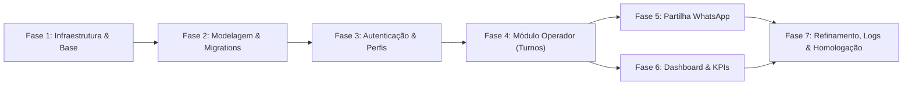

# Plano de Construção do Sistema CAC Atividades

Este documento define as fases sequenciais e incrementais para a implementação completa do sistema **CAC Atividades** (Controlo Atividades Correios), integrando as definições do `docs/FSD.md` e do `docs/DESIGN.md` à base Docker, PostgreSQL, Node.js/Express, Prisma ORM e Nginx já existente.

---

## Visão Geral das Fases

| Fase | Título | Foco Principal | Status |
|:---:|---|---|:---:|
| **1** | Infraestrutura, Docker, Nginx e Estrutura Base | Validação dos containers, volumes, proxy reverso, ambiente e estrutura de pastas | **Concluída / Validada** |
| **2** | Modelagem de Dados, Migrations e Conexão PostgreSQL | Mapeamento das tabelas no Prisma, índices compostos e constraints | **Próxima** |
| **3** | Autenticação, Sessão, Perfis e Recuperação de Senha | `express-session`, `connect-pg-simple`, bcrypt, auto-registo, login, perfil e Nodemailer | **Pendente** |
| **4** | Módulo Operador: Abertura, Fecho, Incidências e Rascunho | Registo diário, validações de integridade, cálculo de eficiência e `localStorage` | **Pendente** |
| **5** | Partilha e Comunicação com WhatsApp | Formatação exata do modelo postal, cópia com 1-clique e envio via `wa.me` | **Pendente** |
| **6** | Dashboard de Indicadores, KPIs, Gráficos e Filtros | Métricas agregadas, filtros por período e colaborador (Admin vs Operador) | **Pendente** |
| **7** | Refinamento UI, Logs de Erro/Segurança e Homologação | Design System *Postal Utility System*, rotação de logs a 90 dias e testes E2E | **Pendente** |

---

## Detalhamento das Fases

### Fase 1: Infraestrutura, Docker, Nginx e Estrutura Base (Adiantada)

#### Objetivo
Garantir que a orquestração via Docker Compose, o banco de dados PostgreSQL 16, a aplicação backend Node.js (com Prisma Client instalado) e o frontend Nginx (com proxy reverso para `/api/`) estejam harmonizados, operando com hot-reload e com as pastas organizadas conforme a arquitetura MVC e as diretrizes do FSD.

#### Checklist de Tarefas
- [x] Configuração do `docker-compose.yml` com os serviços `db`, `backend` e `frontend`.
- [x] Configuração do PostgreSQL 16 Alpine com volume persistente `cac_postgres_data`.
- [x] Configuração do `backend/Dockerfile` com Node 20 Alpine, OpenSSL e hot-reload via `nodemon`.
- [x] Configuração do `frontend/Dockerfile` com Nginx Alpine e `nginx.conf` atuando como Reverse Proxy para `/api/` e servidor de estáticos.
- [x] Configuração inicial do `.env` com parâmetros de banco e porta.
- [ ] Complementar o `.env` e criar `.env.example` com variáveis de sessão (`SESSION_SECRET`), ambiente (`NODE_ENV`) e transporte de e-mail (`SMTP_HOST`, `SMTP_PORT`, `SMTP_USER`, `SMTP_PASS`, `EMAIL_FROM`).
- [ ] Atualizar `docker-compose.yml` para injetar o arquivo `.env` integralmente no serviço backend (`env_file: .env`).
- [ ] Organizar a árvore de diretórios base no backend (`src/config/`, `src/controllers/`, `src/middlewares/`, `src/routes/`, `src/utils/`) e frontend (`public/css/`, `public/js/`, `public/images/`).
- [ ] Validar a rota `/api/health` através do proxy reverso (`http://localhost/api/health`).

#### Critérios de Pronto (Definition of Done)
1. Todos os 3 containers (`cac_db`, `cac_backend`, `nginx_frontend`) sobem sem falhas via `docker compose up -d`.
2. Acessar `http://localhost/` no navegador exibe a página base do Nginx consumindo `/api/health` com sucesso.
3. As variáveis de ambiente do `.env` estão devidamente acessíveis no backend.
4. Pastas estruturais criadas e organizadas sem dependências quebradas.

#### Arquivos Envolvidos
- `docker-compose.yml` (modificação)
- `.env` (complementação)
- `.env.example` (criação)
- `backend/src/config/index.js` (criação)
- `backend/src/routes/index.js` (criação)
- `logs/.gitkeep` (manutenção)

#### Dependências
- Nenhuma (fase inicial).

---

### Fase 2: Modelagem de Dados no Prisma, Migrations e Conexão PostgreSQL

#### Objetivo
Implementar o esquema relacional completo no Prisma ORM (`backend/prisma/schema.prisma`) estritamente aderente ao FSD (Seção 10 e 11), incluindo tipos, constraints de integridade, valores padrão, chaves estrangeiras, índices de alta performance e a tabela para persistência de sessões (`app_sessoes`).

#### Checklist de Tarefas
- [ ] Adicionar dependência do driver `pg` no backend (`package.json`) para integração nativa com o banco e suporte à sessão.
- [ ] Modelar a entidade `Usuario` (`usuarios`):
  - Campos: `id` (BigInt/Autoincrement), `nome_completo`, `numero_sc` (Unique), `telemovel`, `email` (Unique), `senha_hash`, `perfil` (`operador` / `administrador`), `ativo` (Boolean, default true), `token_recuperacao`, `token_expiracao`, `created_at`, `updated_at`.
- [ ] Modelar a entidade `PerfilConfiguracao` (`perfis_configuracao`):
  - Campos: `id`, `usuario_id` (Unique, FK cascade para `Usuario`), `matricula_padrao`, `giro_padrao`, `updated_at`.
- [ ] Modelar a entidade `RegistoDiario` (`registos_diarios`):
  - Campos: `id`, `usuario_id` (FK restrict para `Usuario`), `data_registo` (Date), `status` (`aberto` / `fechado`), `km_inicial`, `km_final`, `matricula_dia`, `giro_dia`, `qtd_objetos`, `qtd_recolhas`, `qtd_avisados`, `qtd_retornos`, `qtd_end_insuficiente`, `qtd_recusados`, `qtd_desc_morada`, `qtd_entregues`, `taxa_eficiencia` (Decimal), `km_percorridos`, `data_hora_abertura`, `data_hora_fecho`, `updated_at`.
  - Constraint de Unicidade: `@@unique([usuarioId, dataRegisto])`.
  - Índices compostos de busca rápida:
    - `@@index([usuarioId, dataRegisto])`
    - `@@index([dataRegisto, status])`
    - `@@index([usuarioId, status])`
- [ ] Modelar a entidade `AuditoriaRegisto` (`auditoria_registos`):
  - Campos: `id`, `registo_diario_id` (FK cascade), `usuario_alteracao_id` (FK restrict), `data_hora_alteracao`, `valores_antigos` (Json), `valores_novos` (Json), `motivo`.
  - Índice: `@@index([registoDiarioId])`.
- [ ] Modelar a entidade `LogSeguranca` (`logs_seguranca`):
  - Campos: `id`, `tipo_evento`, `usuario_id` (FK opcional set null), `ip_origem`, `detalhes` (Text), `created_at`.
- [ ] Modelar/configurar a tabela de sessões `app_sessoes` para uso pelo `connect-pg-simple` (`sid`, `sess`, `expire` com índice em `expire`).
- [ ] Gerar e executar a migration inicial do Prisma (`npx prisma migrate dev --name init_cac_schema`).
- [ ] Criar script de seed opcional (`prisma/seed.js`) para geração do Administrador padrão e dados iniciais de homologação.
- [ ] Testar conexão do Prisma Client com o container PostgreSQL.

#### Critérios de Pronto (Definition of Done)
1. Migration do Prisma executada com sucesso contra o banco `cac_db`.
2. Todas as 5 tabelas de negócio e a tabela `app_sessoes` criadas no PostgreSQL com tipos, checks e constraints exatos.
3. Índices de desempenho confirmados no catálogo do PostgreSQL.
4. Prisma Client gerado e importável em qualquer ponto do backend sem erros de tipagem.

#### Arquivos Envolvidos
- `backend/prisma/schema.prisma` (modificação completa)
- `backend/prisma/seed.js` (criação)
- `backend/package.json` (adição de dependências `pg`)

#### Dependências
- Depende da Fase 1 (PostgreSQL e Node.js operacionais).

---

### Fase 3: Autenticação, Sessão, Perfis e Recuperação de Senha

#### Objetivo
Implementar o ciclo completo de autenticação corporativa segura (auto-registo, login por SC ou e-mail, logout, recuperação de senha com Nodemailer) com sessões gerenciadas pelo `express-session` persistidas no PostgreSQL (`connect-pg-simple`), proteção RBAC e gestão das preferências de perfil (veículo e giro padrão).

#### Checklist de Tarefas
- [ ] Instalar dependências no backend: `express-session`, `connect-pg-simple`, `bcrypt`, `nodemailer`.
- [ ] Configurar middleware de sessão no Express:
  - Cookie `cac_session_id`, `httpOnly: true`, `sameSite: 'lax'`, `secure: false` em dev, `maxAge: 8 horas`.
  - Store configurado via `connect-pg-simple` apontando para a tabela `app_sessoes`.
- [ ] Criar módulo de hash e verificação de senha com `bcrypt` (fator de custo 10).
- [ ] Implementar middleware de autenticação (`backend/src/middlewares/auth.js`):
  - Valida se `req.session.usuario` existe; redireciona ou retorna 401.
- [ ] Implementar middleware de RBAC (`backend/src/middlewares/rbac.js`):
  - Valida se perfil é `administrador`; retorna 403 em caso negativo.
- [ ] Implementar `AuthController`:
  - `POST /api/auth/registo`: Auto-registo de colaborador com perfil fixo `operador` (bloqueio rígido de auto-elevação para `administrador`). Criação automática do `PerfilConfiguracao` associado.
  - `POST /api/auth/login`: Autenticação flexível por Número de Colaborador (SC) ou E-mail com senha hash. Validação de `ativo = true`.
  - `POST /api/auth/logout`: Destruição da sessão e limpeza do cookie.
  - `GET /api/auth/me`: Retorno dos dados do usuário logado e perfil.
- [ ] Implementar fluxo de Recuperação de Senha:
  - Serviço de e-mail centralizado com `Nodemailer` (`backend/src/utils/mailer.js`).
  - `POST /api/auth/recuperar-senha`: Geração de token criptográfico temporário (expiração em 1 hora), gravação no banco e disparo de e-mail. Resposta genérica para evitar enumeração de contas.
  - `POST /api/auth/redefinir-senha`: Validação de validade do token, atualização de `senha_hash` e revogação do token.
- [ ] Implementar `PerfilController`:
  - `GET /api/perfil`: Obtenção dos dados cadastrais e preferências de veículo/giro.
  - `PUT /api/perfil`: Atualização de nome, telemóvel, matrícula padrão, giro padrão e troca voluntária de senha.
- [ ] Construir as interfaces de autenticação e perfil no frontend:
  - Telas baseadas em `docs/extras/design/00-registo-de-utilizador-layout` e `01-iniciar-sessao-layout`.
  - Telas de recuperação de senha e redefinição de senha.
  - Tela de perfil do colaborador com preferências habituais.

#### Critérios de Pronto (Definition of Done)
1. Usuário consegue se registrar como operador, fazer login tanto com SC quanto com E-mail, e manter a sessão ativa após restart do container backend (sessão persistente no banco).
2. Tentativa de auto-elevação para administrador rejeitada no backend.
3. Fluxo de recuperação de senha gera e valida tokens com expiração de 1 hora.
4. Perfil permite salvar Matrícula e Giro padrão para uso nos turnos.

#### Arquivos Envolvidos
- `backend/src/config/session.js` (criação)
- `backend/src/utils/mailer.js` (criação)
- `backend/src/middlewares/auth.js` (criação)
- `backend/src/middlewares/rbac.js` (criação)
- `backend/src/controllers/AuthController.js` (criação)
- `backend/src/controllers/PerfilController.js` (criação)
- `backend/src/routes/auth.routes.js` (criação)
- `backend/src/routes/perfil.routes.js` (criação)
- `frontend/public/login.html`, `registo.html`, `recuperar-senha.html`, `redefinir-senha.html`, `perfil.html` (criação/integração)

#### Dependências
- Depende da Fase 2 (tabelas e Prisma Client prontos).

---

### Fase 4: Módulo Operador: Abertura e Fecho de Turno, Incidências, Validações e Rascunho Local

#### Objetivo
Construir o núcleo operacional do sistema: abertura de turno diário com Km Inicial e dados pré-preenchidos, fecho de turno com contagem de objetos, recolhas e as 5 incidências obrigatórias, validações matemáticas bloqueantes, preservação de digitação via `localStorage` e mecanismo de edição com trilha de auditoria JSONB.

#### Checklist de Tarefas
- [ ] Implementar verificação de estado diário (`GET /api/registos/estado-atual`):
  - Retorna o status do dia atual (`nenhum`, `aberto`, `fechado`).
  - Identifica e sinaliza turno pendente de fecho de dia anterior (alerta não-bloqueante no cabeçalho).
- [ ] Implementar fluxo de Abertura de Turno (`POST /api/registos/abertura`):
  - Pré-carrega Matrícula e Giro padrão do perfil (editáveis pontualmente).
  - Exige Km Inicial digitado do zero (inteiro $\ge 0$).
  - Cria registo em `registos_diarios` com status `aberto` e timestamp de abertura.
  - Garante constraint de unicidade de turno por dia (`usuario_id + data_registo`).
- [ ] Implementar fluxo de Fecho de Turno (`POST /api/registos/fecho`):
  - Recebe: Km Final, Qtd Objetos, Qtd Recolhas, Qtd Avisados, Qtd Retornos, Qtd Endereço Insuficiente, Qtd Recusados, Qtd Desconhecidos na Morada.
  - **Validação Bloqueante 1:** $\text{Km Final} \ge \text{Km Inicial}$ (mensagem: "O Km Final não pode ser inferior ao Km Inicial informado na abertura.").
  - **Validação Bloqueante 2:** $\sum \text{Incidências} \le \text{Qtd Objetos}$ (mensagem: "A soma das incidências (não entregues) não pode ser maior do que a Quantidade Total de Objetos.").
  - **Cálculo de Entregues Efetivos:** $\text{Objetos} - \sum \text{Incidências}$.
  - **Cálculo de Eficiência (%):** $((\text{Entregues} + \text{Recolhas}) / (\text{Objetos} + \text{Recolhas})) \times 100$ (com tratamento para divisão por zero resultando em 0.00%).
  - **Cálculo de Km Percorridos:** $\text{Km Final} - \text{Km Inicial}$.
  - Atualiza status para `fechado` e registra timestamp de fecho.
- [ ] Implementar script de Rascunho Local no Frontend (`frontend/public/js/draft-storage.js`):
  - Captura eventos `input`/`change` dos formulários e grava instantaneamente em `localStorage`.
  - Restaura valores automaticamente se a página for recarregada.
  - Limpa o rascunho com sucesso após a confirmação do envio ao backend.
- [ ] Implementar Edição de Registos Diários com Auditoria (`PUT /api/registos/:id`):
  - Permissão: Operador pode editar apenas seus próprios turnos; Administrador pode editar qualquer turno.
  - Campo obrigatório: `motivo` da alteração.
  - Transação SQL atômica: atualiza `registos_diarios` e insere entrada em `auditoria_registos` contendo `valores_antigos` (JSONB) e `valores_novos` (JSONB).
  - Regravação no log de segurança da ocorrência de edição.
- [ ] Construir as telas de operação no frontend:
  - Abertura de Turno (protótipo `02-inicio-de-turno-layout`).
  - Fecho de Turno com contadores de incidências (protótipo `03-fim-de-turno-layout`).
  - Tela de histórico/registo diário (protótipo `04-registo-diario-layout`).
  - Modal/tela de edição justificada de registo.

#### Critérios de Pronto (Definition of Done)
1. Operador consegue abrir turno informando Km Inicial com matrícula e giro pré-carregados.
2. Não é possível fechar turno com Km Final menor que o Inicial ou com incidências superiores ao total de objetos.
3. Fórmulas de Entregues, Km Percorridos e Eficiência calculadas com precisão e persistidas no banco.
4. Se o navegador for recarregado durante a digitação do fecho, todos os números são restaurados via `localStorage`.
5. Edições em turnos gravam auditoria completa com comparativo JSONB e motivo justificado.

#### Arquivos Envolvidos
- `backend/src/controllers/RegistoDiarioController.js` (criação)
- `backend/src/routes/registos.routes.js` (criação)
- `backend/src/utils/calculos.js` (criação)
- `frontend/public/js/draft-storage.js` (criação)
- `frontend/public/abertura.html`, `fecho.html`, `registos.html` (criação/integração)

#### Dependências
- Depende da Fase 3 (autenticação e perfil do colaborador operacionais).

---

### Fase 5: Integração de Partilha e Comunicação com WhatsApp

#### Objetivo
Implementar a geração automática da mensagem de relatório formatada rigorosamente conforme o modelo oficial postal da empresa, disponibilizando ações de 1-clique para cópia para a área de transferência e envio direto via protocolo web para o WhatsApp.

#### Checklist de Tarefas
- [ ] Criar utilitário de formatação de mensagem no backend e frontend (`formatters.js`):
  - Formatar datas como `DD/MM/YYYY`.
  - Respeitar a formatação de negrito e itálico do WhatsApp (`*_[DD/MM/YYYY]_*`).
  - Estruturar blocos `*Início*` e `*Final*` com todos os campos conforme `docs/extras/cac-model.txt` e FSD Seção 14.
  - Exibir valores de incidências vazios como `**` quando for zero ou não aplicável, conforme o modelo oficial.
- [ ] Implementar endpoint de pré-visualização de mensagem (`GET /api/registos/:id/whatsapp-preview`).
- [ ] Construir a tela/modal de confirmação de partilha baseada em `docs/extras/design/05-resumo-de-partilha-layout`:
  - Pré-visualização do texto exato dentro de um cartão estilizado.
  - Botão **"Copiar Texto"**: Aciona a API nativa `navigator.clipboard.writeText()` e exibe confirmação visual tátil (toast/badge: "Copiado com sucesso!").
  - Botão **"Enviar para WhatsApp"**: Redireciona para `https://wa.me/?text=[TEXTO_ENCODED]` abrindo o WhatsApp Web ou o app nativo no celular.
- [ ] Garantir que o fechamento do turno redireciona fluidamente para esta tela de confirmação.

#### Critérios de Pronto (Definition of Done)
1. Texto gerado coincide perfeitamente com a estrutura do modelo oficial em `docs/extras/cac-model.txt`.
2. Botão "Copiar Texto" copia a mensagem sem alterar quebras de linha ou caracteres especiais.
3. Botão "Enviar para WhatsApp" abre a conversa no WhatsApp pronta para envio.
4. Funciona tanto em navegadores móveis (Android/iOS) quanto em desktops.

#### Arquivos Envolvidos
- `backend/src/utils/formatters.js` (criação)
- `frontend/public/js/whatsapp-share.js` (criação)
- `frontend/public/confirmar-whatsapp.html` (criação/integração)

#### Dependências
- Depende da Fase 4 (turno fechado com todos os dados calculados).

---

### Fase 6: Dashboard de Indicadores, KPIs, Gráficos e Filtros

#### Objetivo
Construir o painel de análise visual de desempenho operacional para Operadores e Administradores, exibindo os 5 cartões de KPIs principais, gráfico de barras comparativo (Entregues vs. Incidências) e tabela de histórico com filtros de período temporal e seletor de colaborador.

#### Checklist de Tarefas
- [ ] Implementar `DashboardController` (`GET /api/dashboard/indicadores`):
  - **Filtros Temporais:** `dia` (Hoje), `semana` (últimos 7 dias / semana atual), `mes` (mês corrente), `ano` (ano corrente).
  - **Controle de Acesso (RBAC):**
    - Se perfil for `operador`: força agregação exclusivamente onde `usuario_id = req.session.usuario.id`.
    - Se perfil for `administrador`: permite consultar "Toda a Empresa" (`usuario_id = null`) ou filtrar por um `usuario_id` específico.
  - **Cálculo dos 5 Indicadores Agregados:**
    1. Total de Objetos Entregues Efetivos ($\sum \text{qtd\_entregues}$).
    2. Total de Incidências Registadas ($\sum (\text{avisados} + \text{retornos} + \text{end\_insuf} + \text{recusados} + \text{desc\_morada})$).
    3. Total de Km Percorridos ($\sum \text{km\_percorridos}$).
    4. Taxa Média de Eficiência Ponderada ($\frac{\sum \text{Entregues} + \sum \text{Recolhas}}{\sum \text{Objetos} + \sum \text{Recolhas}} \times 100$).
    5. Dias de Atividade Registados (contagem de turnos concluídos no período).
  - **Dados para Gráfico Comparativo:** Série temporal ou agregação total de Entregues Efetivos vs Não Entregues.
  - **Lista de Histórico:** Turnos do período com paginação/limite e suporte a ação "Ver / Editar".
- [ ] Implementar endpoint para lista de colaboradores ativos (`GET /api/dashboard/colaboradores`) com acesso restrito a administradores.
- [ ] Construir a interface do Dashboard no frontend:
  - Baseada nos protótipos `06-relatorio-diario-de-atividade` e `07-relatorio-mensal-layout`.
  - Cartões de KPI com tipografia de destaque do *Postal Utility System*.
  - Gráfico comparativo renderizado via Chart.js local (mantido na pasta estática, sem CDN externa) ou componente SVG puro de alta performance.
  - Filtros rápidos por chips de período e dropdown de seleção de colaborador para Admin.
  - Tabela responsiva com status visual (badge verde para Fechado, amarelo para Aberto).

#### Critérios de Pronto (Definition of Done)
1. Operador visualiza estritamente os seus próprios dados consolidados.
2. Administrador consegue alternar perfeitamente entre "Toda a Empresa" e colaboradores individuais.
3. Mudança de período (Dia, Semana, Mês, Ano) atualiza dinamicamente os 5 KPIs e o gráfico sem quebrar layout.
4. Consultas executadas com alta performance, aproveitando os índices criados na Fase 2.

#### Arquivos Envolvidos
- `backend/src/controllers/DashboardController.js` (criação)
- `backend/src/routes/dashboard.routes.js` (criação)
- `frontend/public/dashboard.html` (criação/integração)
- `frontend/public/js/dashboard.js` (criação)
- `frontend/public/js/chart.min.js` (biblioteca local adicionada)

#### Dependências
- Depende da Fase 4 (dados operacionais registrados e validados) e Fase 3 (sessão e RBAC).

---

### Fase 7: Ajustes Finais, Refinamento de UI, Logs, Segurança e Homologação

#### Objetivo
Consolidar a aplicação de ponta a ponta com o Design System *Postal Utility System*, implementar a infraestrutura de logs (arquivo e segurança) com retenção de 90 dias e contingência em falhas de banco, realizar auditoria de segurança (XSS, CSRF, sanitização) e validar todos os critérios de aceitação do FSD.

#### Checklist de Tarefas
- [ ] Refinamento e Validação Estrita do Design System (`docs/DESIGN.md`):
  - Garantir ausência de CDNs externas em todas as telas (Bootstrap, ícones e fontes 100% locais).
  - Paleta CTT Red (`#a8001c`, `#d3122a`, `#ffe6e4`, `#f9f9f9`, `#ffffff`, `#5f5e5e`, `#066018`).
  - Inputs com altura mínima de 56px e labels persistentes no topo.
  - Alvos de toque (botões e links móveis) com altura e largura mínima de 48px.
  - Cantos arredondados de 8px (0.5rem) e grid base de 4px.
  - Layout mobile-first fluido, centralizado em até 768px em telas maiores.
- [ ] Implementar Módulo de Logging Avançado (`backend/src/utils/logger.js`):
  - Gravação de erros da aplicação em `logs/app-error.log` com timestamp, nível, rota e stack trace.
  - Rotina de rotação e limpeza automática de logs com mais de 90 dias.
  - Gravação de eventos de segurança em `logs_seguranca` e no arquivo `logs/security.log`.
  - **Mecanismo de Contingência:** Em caso de perda de conexão com o PostgreSQL, o logger captura a exceção, grava no arquivo local sem derrubar a aplicação e exibe tela de contingência amigável ao usuário.
- [ ] Revisão e Blindagem de Segurança:
  - Headers de segurança HTTP configurados no Express / Nginx.
  - Sanitização de inputs contra XSS e injeção de tags em formulários.
  - Tratamento global de erros para ocultar stack traces do usuário final em produção.
  - Proteção contra manipulação de parâmetros de turnos de outros operadores.
- [ ] Homologação de Ponta a Ponta no Ambiente Docker:
  - Testar Fluxo 1: Auto-registo de colaborador e configuração de perfil.
  - Testar Fluxo 2: Abertura de turno e aviso de pendência anterior.
  - Testar Fluxo 3: Fecho com validação matemática e envio para o WhatsApp.
  - Testar Fluxo 4: Edição de turno com histórico de auditoria JSONB.
  - Testar Fluxo 5: Filtros e visões consolidadas do Dashboard para Administrador.
  - Testar Fluxo 6: Recuperação de senha por e-mail com token temporário.
- [ ] Verificação final de todos os itens da seção 26 do `docs/FSD.md` (Critérios de Aceitação).

#### Critérios de Pronto (Definition of Done)
1. 100% dos critérios da Seção 26 do FSD cumpridos e verificados.
2. Nenhuma requisição a CDNs externas é disparada na inspeção de rede.
3. Logs de erro e segurança funcionando com rotação e gravação silenciosa em contingência.
4. A aplicação é totalmente funcional em dispositivos móveis e desktops.
5. Documentação viva (`docs/STATUS.md` e `docs/ERROS.md`) atualizada com o resultado da homologação.

#### Arquivos Envolvidos
- `backend/src/utils/logger.js` (criação)
- `frontend/public/css/custom.css` (refinamento)
- `frontend/public/css/bootstrap.min.css` (arquivo local adicionado)
- `docs/STATUS.md` e `docs/ERROS.md` (atualização final)

#### Dependências
- Depende das Fases 1 a 6 concluídas.
